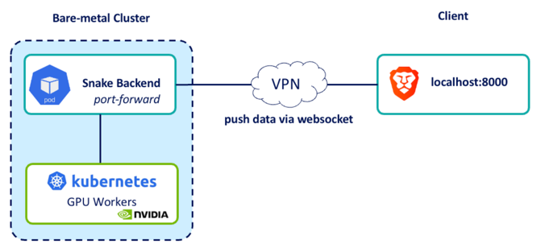

# KubeSlither 🐍

**Reinforcement Learning Snake at Scale**  
*Training intelligent snakes on Kubernetes with GPU acceleration*

The core training part of this project is based on snake-ai-pytorch by Patrick Loeber.
https://github.com/patrickloeber/snake-ai-pytorch
---

### 🎮 Live Demo

A real-time Snake game where an AI agent learns to play using **Deep Q-Learning**, powered by PyTorch and served via FastAPI + WebSocket.

Watch the snake improve live as it trains on K8s with GPU support.

#### Architecture


---

### ✨ Features

- **Real-time Web Visualization** – Play/watch the snake learning in your browser
- **Deep Q-Network (DQN)** – Custom PyTorch neural network
- **Distributed Training Ready** – Designed for Kubernetes + GPU clusters
- **FastAPI + WebSocket** – Smooth real-time interaction
- **Live Stats** – Score, average score, epsilon decay, and training progress

---

### 🚀 Quick Start

#### Local

```bash
# 1. Install
python -m venv kubeslither_env
source kubeslither_env/bin/activate
pip install -r requirements.txt

# 2. Run
python -m uvicorn server:app --host 0.0.0.0 --port 8000
```

#### Docker
```bash
# 1. Build
docker build --platform=linux/amd64 . -t kube-slither

# 2. Run
docker run kube-slither -p 8000:8000
https://localhost:8000

```
##### Kubernetes
Details will heavily depend on the specific Kubernetes setup.
See sample pod definition in ./k8s-sample
```bash
# 1. Deploy standalone pod
kubectl apply -f k8s-sample/kube-slither.yaml

# 2. Expose via port-forward (for testing)
kubectl port-forward kube-slither 8000:800
```